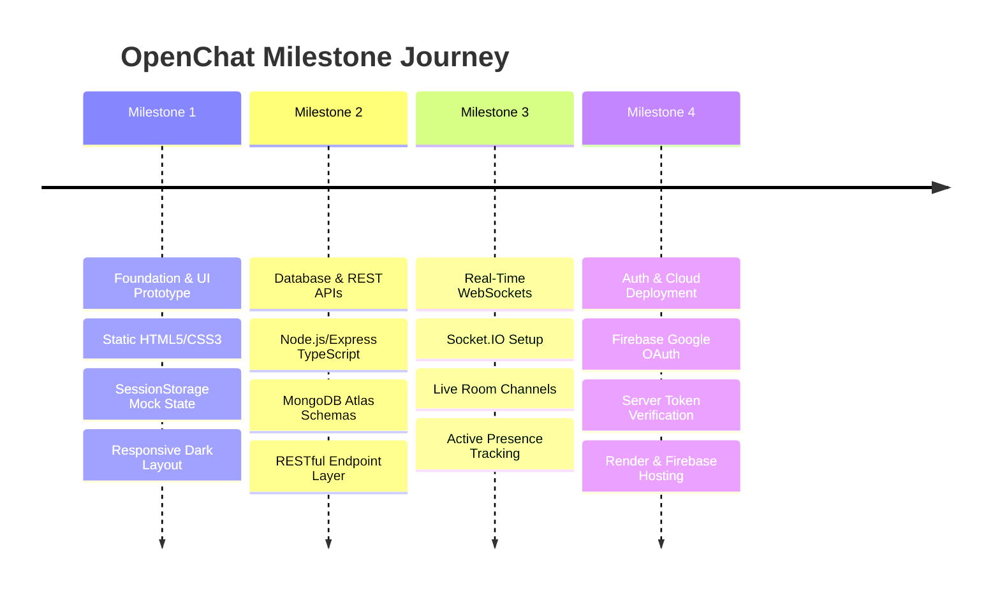
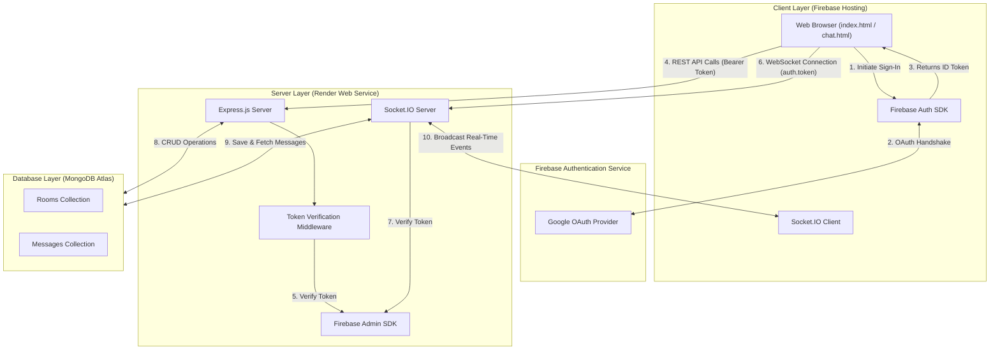

# OpenChat 💬 — Real-Time Public & Protected Chat Platform

[](#2-journey-so-far-milestone-by-milestone-progression)
[](https://learning-d6257.web.app/)
[](https://openchat-bvzt.onrender.com)
[](https://www.typescriptlang.org/)
[](https://nodejs.org/)
[](https://socket.io/)
[](https://www.mongodb.com/cloud/atlas)

> **OpenChat** is a feature-packed, real-time web application for public and password-protected chat rooms. Built with a Node.js + Express + TypeScript backend, Socket.IO live broadcasting, MongoDB Atlas persistent database, Firebase Google OAuth Authentication, and hosted globally on **Firebase Hosting** and **Render**.

---

## 🔗 Live Deployed Links

- 🌐 **Live Web Application (Frontend)**: [https://learning-d6257.web.app/](https://learning-d6257.web.app/)
- ⚙️ **Backend API & WebSockets (Render)**: [https://openchat-bvzt.onrender.com](https://openchat-bvzt.onrender.com)

---

## 📌 Table of Contents

1. [Project Overview](#1-project-overview)
2. [Journey So Far: Milestone-by-Milestone Progression](#2-journey-so-far-milestone-by-milestone-progression)
3. [Key Features](#3-key-features)
4. [Technology Stack & Tools](#4-technology-stack--tools)
5. [System Architecture & Conceptual Flow](#5-system-architecture--conceptual-flow)
6. [Data Models (Simplified Specs)](#6-data-models-simplified-specs)
7. [API & WebSocket Specifications](#7-api--websocket-specifications)
8. [Core System Logic & Pseudocode](#8-core-system-logic--pseudocode)
9. [Project Directory Structure](#9-project-directory-structure)
10. [Local Development Setup](#10-local-development-setup)

---

## 1. Project Overview

| Property | Details |
| --- | --- |
| **Project Name** | OpenChat — Real-Time Public & Protected Chat Platform |
| **Branch** | `milestone-4` |
| **Objective** | Build a production-grade real-time chat application with persistent MongoDB storage, secure Firebase Google Auth, socket authentication middleware, dynamic room creation, password protection, and live cloud deployment. |
| **Target Audience** | Web users looking for instant public or private topic-based chat rooms. |

---

## 2. Journey So Far: Milestone-by-Milestone Progression

The development of **OpenChat** followed an incremental, milestone-driven capstone workflow:



### 🚩 Milestone 1 — Foundation & UI Prototype
- **Goal**: Establish repository structure, create dark-themed responsive UI, and simulate room navigation using browser storage.
- **Key Deliverables & Accomplishments**:
  - Developed full client UI layout with custom CSS3 dark theme, glowing ambient accents, glassmorphism cards, and responsive flex/grid layouts.
  - Implemented dynamic avatar initials generator based on user names.
  - Created room sidebar supporting preset rooms (*General, JavaScript, Movies, Sports*) and custom room input.
  - Built client-side mock authentication simulator using HTML5 `sessionStorage`.
  - Added interactive toast notifications and responsive collapsible navigation for mobile viewports.

---

### 🚩 Milestone 2 — Database Integration & REST APIs
- **Goal**: Connect MongoDB cloud database, define object schemas, and build Express.js RESTful API services in TypeScript.
- **Key Deliverables & Accomplishments**:
  - Initialized Node.js + Express backend project structure using TypeScript (`tsc`, `ts-node-dev`).
  - Integrated MongoDB Atlas cloud cluster using Mongoose ODM with automated connection retry logic and IPv4 DNS fallback.
  - Designed Mongoose schemas for `Room` (room name, password, creator ID) and `Message` (room ID, user ID, display name, photo URL, text message, timestamp).
  - Built RESTful endpoints for fetching all rooms (`GET /api/rooms`), creating rooms (`POST /api/rooms`), verifying room passwords (`POST /api/rooms/:id/verify`), and retrieving message history (`GET /api/messages/:roomId`).
  - Added centralized logger, error handler, and route fallback middlewares.

---

### 🚩 Milestone 3 — Real-Time WebSocket Communication
- **Goal**: Implement live bi-directional message broadcasting, room channels, and real-time user presence tracking using Socket.IO.
- **Key Deliverables & Accomplishments**:
  - Integrated Socket.IO server on backend HTTP instance and modular Socket.IO client manager on frontend.
  - Implemented real-time room joining and leaving (`join-room`, `leave-room` socket channels).
  - Created instant message broadcasting (`send-message` $\rightarrow$ `receive-message`), saving incoming messages synchronously into MongoDB Atlas.
  - Developed real-time presence engine: maintained an in-memory tracking map of online sockets per room, broadcasting updated online user lists (`online-users`) and live user count badges across sidebar room lists (`room-online-count`).
  - Implemented system notification alerts (`user-joined` and `user-left`) when members connect or disconnect.

---

### 🚩 Milestone 4 — Authentication, Security & Cloud Deployment
- **Goal**: Secure the application with Firebase Google OAuth, enforce server-side ID token verification, and deploy frontend and backend to production cloud platforms.
- **Key Deliverables & Accomplishments**:
  - Replaced mock login with **Firebase Authentication Google OAuth** popup flow on `index.html`.
  - Integrated **Firebase Admin SDK** on the server for cryptographic verification of Firebase ID tokens.
  - Secured REST API routes with `verifyFirebaseToken` Express middleware inspecting `Bearer <token>` headers.
  - Secured Socket.IO connection handshakes using Socket.IO middleware verifying `auth.token`.
  - Replaced native browser `prompt` dialogs with custom styled accessible UI modal prompts for room password entries.
  - **Cloud Deployments**:
    - Frontend static application deployed globally via **Firebase Hosting** ([https://learning-d6257.web.app/](https://learning-d6257.web.app/)).
    - TypeScript Node.js backend deployed to **Render Web Service** ([https://openchat-bvzt.onrender.com](https://openchat-bvzt.onrender.com)).

---

## 3. Key Features

- 🔐 **Firebase Google Authentication**:
  - One-click Google OAuth sign-in via client popup flow.
  - Token-based security: Client passes Firebase ID Tokens on both HTTP REST APIs (`Bearer <token>`) and Socket.IO connection handshakes (`auth.token`).
- 💬 **Real-Time Messaging (Socket.IO)**:
  - Instant message delivery to all members connected to a room channel.
  - Synchronous save to MongoDB Atlas so chat logs persist across client reloads.
- 🔒 **Password-Protected Chat Rooms**:
  - Option to protect custom chat rooms with custom passwords (default password: `2222`).
  - Server-side password verification endpoint (`POST /api/rooms/:id/verify`) before granting room access.
- 👥 **Real-Time Presence & Online User Tracking**:
  - Live online user list side-drawer per room with profile avatars.
  - Active user count badges dynamically updated across all rooms in real-time.
  - Automatic `user-joined` and `user-left` system notifications when members enter or leave.
- 🎨 **Modern Dark UI Design**:
  - Custom color palette with glowing gradient overlays, dark glassmorphism cards, and responsive sidebar navigation.
  - Dynamic avatar initials generator and custom UI modal prompts (replacing native `prompt` dialogs).

---

## 4. Technology Stack & Tools

### Frontend
- **HTML5 & CSS3**: Semantic layout, Flexbox & Grid, CSS variables, glassmorphism dark theme, custom responsive sidebar.
- **Vanilla JavaScript (ES6+)**: Modular application state split across `auth.js`, `api.js`, `socket.js`, `chat.js`, and `common.js`.
- **Firebase Auth Web SDK (v10 Compat)**: Client authentication engine handling Google OAuth provider popups.
- **Socket.IO Client SDK (v4.8)**: Client-side WebSocket connection manager handling room subscription and real-time events.

### Backend
- **Node.js & Express.js**: High-performance HTTP server environment for RESTful API services.
- **TypeScript**: Strict type checking and enterprise-grade code architecture (`tsconfig.json`).
- **Socket.IO (v4.8)**: Real-time event broadcasting engine with custom authentication middleware.
- **Firebase Admin SDK (v14)**: Server-side ID Token verification and backend authorization layer.
- **MongoDB Atlas & Mongoose (v8)**: Cloud Document Database and object data modeling for rooms and messages.
- **ts-node-dev**: Hot-reloading development server for rapid iteration.

### Deployment & Cloud Infrastructure
- **Firebase Hosting**: High-speed CDN deployment for static frontend application assets (`.firebaserc`, `firebase.json`).
- **Render Cloud Service**: Production hosting environment for the TypeScript Express & Socket.IO backend service.

---

## 5. System Architecture & Conceptual Flow

### System Diagram



---

## 6. Data Models (Simplified Specs)

### 1. Room Model (`rooms`)
Represents a public or password-protected chat room.
- `roomName`: *(String, Required, Unique)* — Human-readable name of the chat room.
- `password`: *(String, Optional)* — Access password required to enter room (Default: `'2222'`).
- `creatorId`: *(String, Optional)* — Firebase User ID of creator.
- `createdAt`: *(Date)* — Timestamp when room was created.

### 2. Message Model (`messages`)
Represents a chat message posted within a specific room.
- `roomId`: *(ObjectId, Required)* — References the target Room document.
- `userId`: *(String, Required)* — Firebase User ID of sender.
- `displayName`: *(String, Required)* — User's display name or email.
- `photoURL`: *(String, Optional)* — Profile avatar URL from Google account.
- `message`: *(String, Required)* — Text message payload.
- `createdAt`: *(Date)* — Timestamp when message was created.

---

## 7. API & WebSocket Specifications

### REST API Endpoints

Base API URL: `https://openchat-bvzt.onrender.com/api`

| Endpoint | Method | Auth | Description |
| --- | --- | --- | --- |
| `/auth/config` | `GET` | Public | Returns client Firebase SDK configuration. |
| `/rooms` | `GET` | Bearer Token | Retrieves all available chat rooms. |
| `/rooms/:id` | `GET` | Bearer Token | Fetches single room details by ID. |
| `/rooms` | `POST` | Bearer Token | Creates a new chat room (`roomName`, optional `password`). |
| `/rooms/:id/verify` | `POST` | Bearer Token | Verifies entered room password before granting access. |
| `/messages/:roomId` | `GET` | Bearer Token | Fetches persistent chat history for a specific room. |

---

### Real-Time WebSocket Events

Connection URL: `https://openchat-bvzt.onrender.com`

#### Client $\rightarrow$ Server Events
- `join-room` `{ roomId }`: Registers socket connection to target room channel.
- `send-message` `{ roomId, message }`: Transmits new chat message to server.
- `leave-room` `{ roomId }`: Removes socket connection from room channel.

#### Server $\rightarrow$ Client Events
- `receive-message` `{ messageObj }`: Broadcasts new message to all members in room.
- `user-joined` `{ username, timestamp }`: System notification when user joins room.
- `user-left` `{ username, timestamp }`: System notification when user leaves room.
- `online-users` `[ userList ]`: Sends list of active users in current room.
- `room-online-count` `{ roomId, count }`: Broadcasts updated online user count for sidebar.

---

## 8. Core System Logic & Pseudocode

### 1. Server Initialization & Socket Setup Logic (Pseudocode)

```text
FUNCTION StartServer():
    // 1. Initialize Firebase Admin SDK for server-side token validation
    INITIALIZE FirebaseAdminSDK WITH EnvironmentCredentials
    
    // 2. Connect to MongoDB Atlas Cloud Database
    CONNECT TO MongoDatabase WITH RetryLogic AND IPv4Fallback
    
    // 3. Create HTTP Server & Bind Express App
    CREATE HttpServer USING ExpressApp
    
    // 4. Attach Socket.IO Engine to Server with CORS policy
    INITIALIZE SocketServer ON HttpServer
    
    // 5. Register Authentication Middleware on Sockets
    ATTACH Middleware ON SocketServer:
        FOR EACH IncomingSocketConnection:
            VERIFY SocketHandshakeToken USING FirebaseAdminSDK
            IF Token Is Valid THEN
                STORE UserData IN Socket.Data
                ALLOW Connection
            ELSE
                REJECT Connection WITH AuthenticationError
                
    // 6. Listen for incoming socket connections
    ON SocketConnection DO:
        REGISTER ConnectionSocketHandlers(Socket)
        
    START HttpServer LISTENING ON DesignatedPort
END FUNCTION
```

---

### 2. Express Route Authentication Middleware Logic (Pseudocode)

```text
FUNCTION VerifyBearerToken(Request, Response, Next):
    EXTRACT AuthorizationHeader FROM Request.Headers
    
    IF AuthorizationHeader IS MISSING OR DOES NOT START WITH "Bearer " THEN:
        RETURN Response HTTP 401 ("Unauthorized: Missing token")
    END IF

    EXTRACT Token FROM AuthorizationHeader
    
    TRY:
        DecodedUser = FirebaseAdminSDK.VerifyIdToken(Token)
        Attach DecodedUser TO Request.User
        CALL Next() // Proceed to route controller
    CATCH Error:
        RETURN Response HTTP 401 ("Unauthorized: Invalid or expired token")
END FUNCTION
```

---

### 3. Real-Time Message Processing & Broadcast Logic (Pseudocode)

```text
FUNCTION HandleSendMessage(Socket, RoomId, MessageText):
    // 1. Authenticate Sender
    SenderUser = Socket.Data.User
    IF SenderUser IS NULL THEN:
        EMIT "error" TO Socket ("Authentication required")
        RETURN
    END IF

    TRY:
        // 2. Persist Message into MongoDB Database
        NewMessage = CREATE MessageDocument IN Database (
            RoomId      = RoomId,
            UserId      = SenderUser.Uid,
            DisplayName = SenderUser.DisplayName,
            PhotoURL    = SenderUser.PhotoURL,
            Message     = MessageText,
            CreatedAt   = CurrentTimestamp
        )

        // 3. Broadcast Saved Message to All Clients Connected to Room Channel
        BROADCAST Event "receive-message" WITH NewMessage TO ALL Sockets IN RoomId
    CATCH Error:
        EMIT "error" TO Socket ("Failed to process message")
END FUNCTION
```

---

### 4. Room Presence & Disconnect Logic (Pseudocode)

```text
FUNCTION HandleUserDisconnect(Socket):
    User = REMOVE Socket.Id FROM OnlineUsersMap
    
    IF User EXISTS THEN:
        RoomId = User.RoomId
        DisplayName = User.DisplayName

        // 1. Notify remaining room members that user left
        BROADCAST Event "user-left" WITH { DisplayName, Timestamp } TO RoomId
        
        // 2. Broadcast updated list of online members in room
        RemainingMembers = GET_ONLINE_USERS(RoomId)
        BROADCAST Event "online-users" WITH RemainingMembers TO RoomId
        
        // 3. Broadcast updated active count to all global clients
        BROADCAST Event "room-online-count" WITH { RoomId, Count = RemainingMembers.Length } TO ALL
    END IF
END FUNCTION
```

---

## 9. Project Directory Structure

```text
openChat/
├── .firebaserc                       # Firebase Hosting target configuration
├── firebase.json                     # Firebase Hosting rules & public build settings
├── README.md                         # Project documentation
├── backend/
│   ├── .env                          # Server secrets (Mongo URI, Firebase credentials)
│   ├── package.json                  # Node dependencies & npm scripts
│   ├── tsconfig.json                 # TypeScript compiler configuration
│   └── src/
│       ├── app.ts                    # Express application setup & middleware mounting
│       ├── server.ts                 # Server entry point, HTTP & Socket bootstrapping
│       ├── config/                   # DB, Firebase Admin & Socket configs
│       ├── controllers/              # REST request handlers (Auth, Rooms, Messages)
│       ├── middleware/               # Auth verification & error handling middlewares
│       ├── models/                   # Mongoose data models (Room, Message)
│       ├── routes/                   # API routing definitions
│       ├── services/                 # Business logic & DB interaction layer
│       ├── sockets/                  # Real-time WebSocket event dispatchers
│       └── types/                    # TypeScript interfaces & types
└── frontend/
    ├── index.html                    # Google Auth login page
    ├── chat.html                     # Main real-time chat application screen
    ├── css/                          # Common, login & chat layout stylesheets
    └── js/                           # Modular client scripts (auth, api, socket, chat, common)
```

---

## 10. Local Development Setup

### Prerequisites
- **Node.js**: v18.0.0 or higher
- **npm**: v9.0.0 or higher
- **MongoDB**: Active MongoDB Atlas URI
- **Firebase Project**: Firebase Auth with Google OAuth enabled & Admin SDK credentials

### Quick Start Guide

```bash
# 1. Clone repo and switch to milestone-4 branch
git clone https://github.com/vanshgupta15/openChat.git
cd openChat
git checkout milestone-4

# 2. Setup and run backend
cd backend
npm install

# Create backend/.env with MONGO_URI and FIREBASE_* credentials
npm run dev

# 3. Serve frontend
# Open frontend/index.html in browser or serve via Live Server / npx serve frontend
```

---